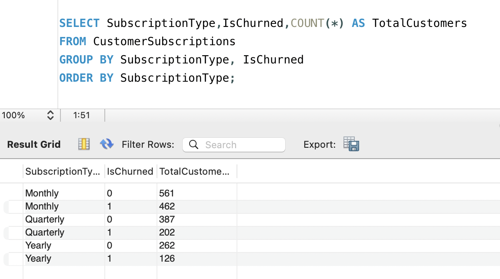
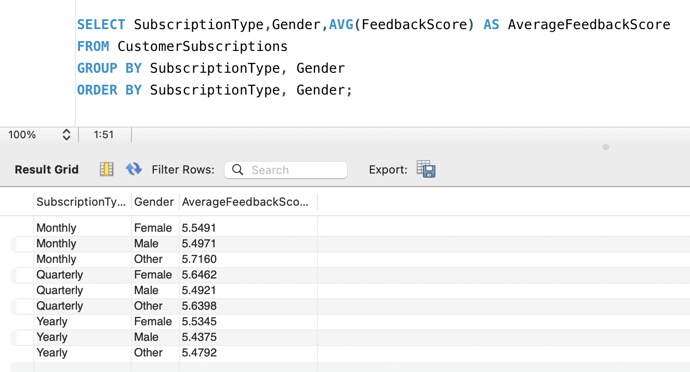
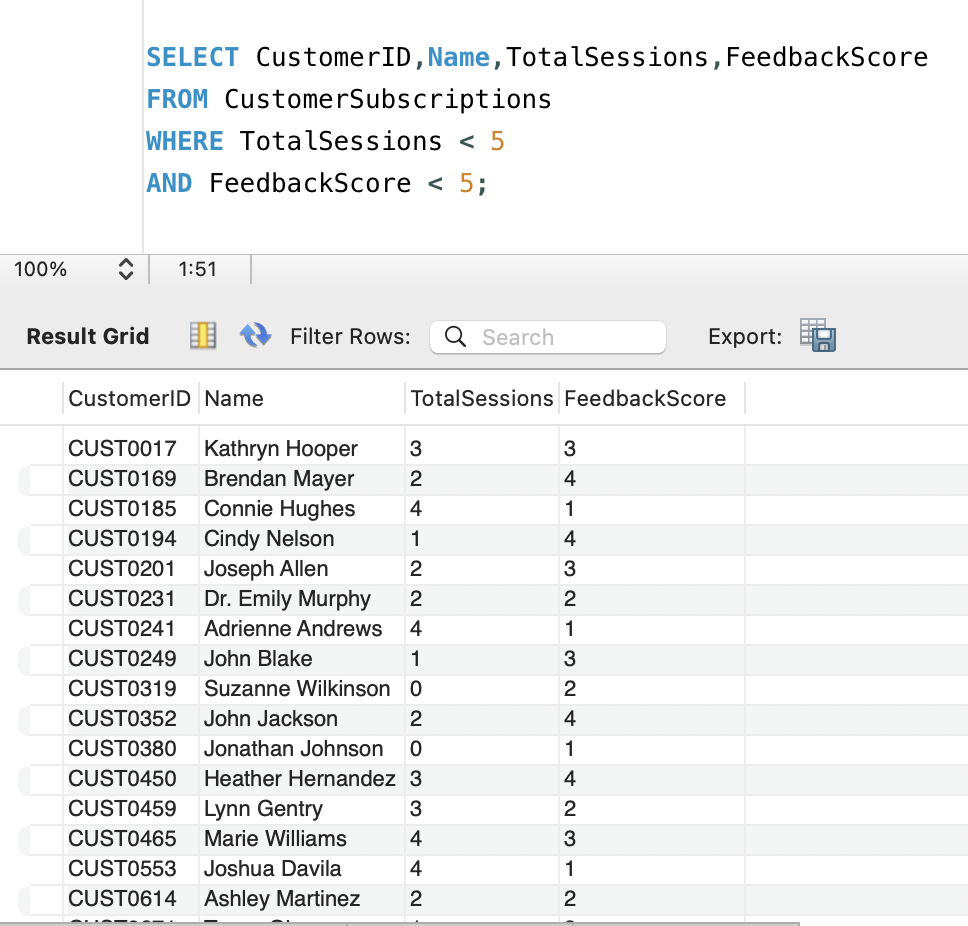
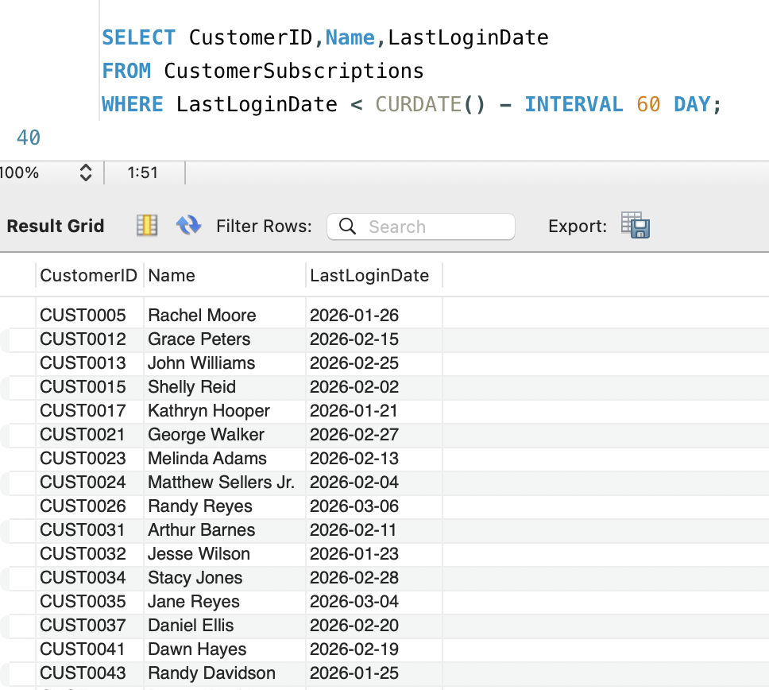
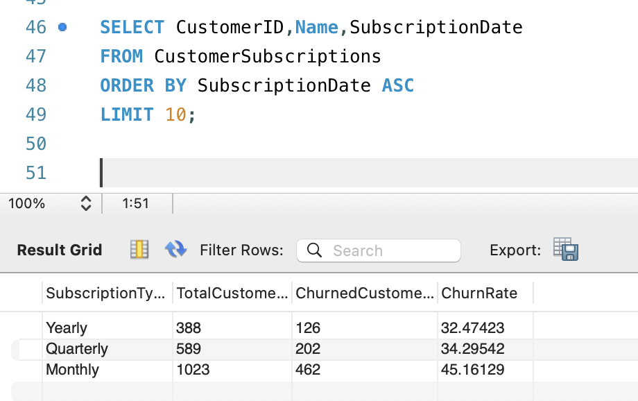
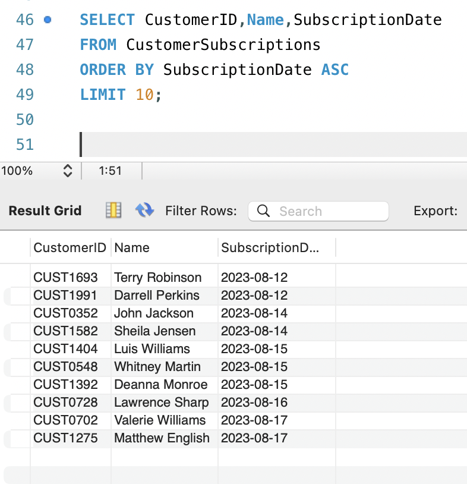
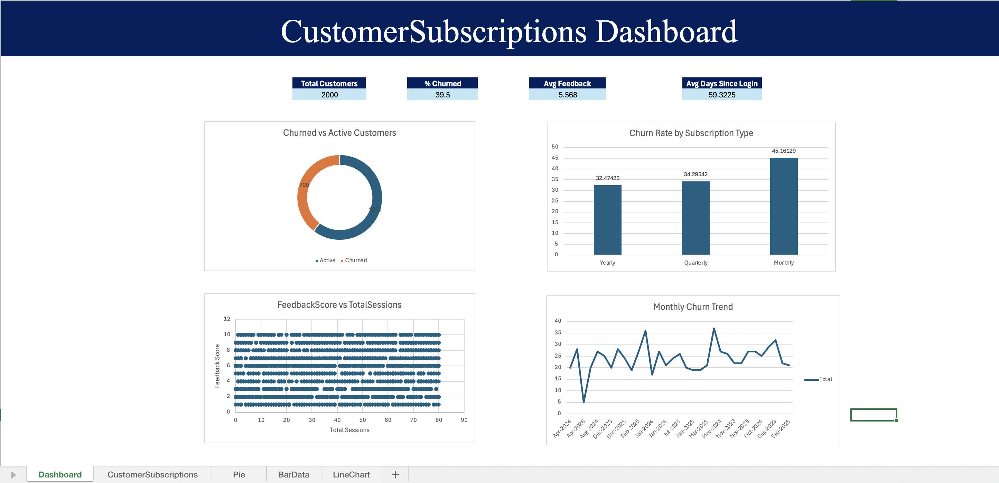

# 📊 Customer Churn Analysis Dashboard

A standalone business case-based practical project focused on analyzing customer churn behavior in subscription-based fitness and wellness services using SQL and Excel.

---

# 📁 Project Structure

```text
Standalone_Business_Case-Based Practical/
│
├── CustomerSubscriptions.csv
├── CustomerSubscriptions.xlsx
├── ChurnedVsActive.csv
├── ChurnRateByType.csv
├── ChurnSummary.txt
│
└── Screenshots/
    ├── 1.png
    ├── 2.png
    ├── 3.png
    ├── 4.png
    ├── 5.png
    ├── 6.png
    └── 7.png
```

---

# 🎯 Project Objective

The objective of this project is to analyze customer churn risk and identify patterns affecting customer retention in subscription-based services.

The analysis helps answer questions like:

- Which subscription type has the highest churn?
- Are inactive customers more likely to leave?
- Does feedback score impact churn?
- Does session attendance affect customer retention?

---

# 🛠 Technologies Used

| Tool | Purpose |
|---|---|
| MySQL Workbench | SQL Analysis |
| SQL | Data Querying |
| Microsoft Excel | Dashboard & Data Visualization |

---

# 🗂 Dataset Information

Dataset Name:

```text
CustomerSubscriptions.csv
```

Dataset includes:

| Column | Description |
|---|---|
| CustomerID | Unique customer ID |
| Name | Customer name |
| Age | Age of customer |
| Gender | Male / Female / Other |
| SubscriptionType | Monthly / Quarterly / Yearly |
| SubscriptionDate | Subscription start date |
| LastLoginDate | Last login date |
| TotalSessions | Total sessions attended |
| FeedbackScore | Rating from 1–10 |
| IsChurned | 1 = Churned, 0 = Active |

---

# 📌 SQL Queries Performed

## ✅ Query 1
Active vs Churned customers by subscription type.

## ✅ Query 2
Average feedback score by subscription type and gender.

## ✅ Query 3
Customers with:
- TotalSessions < 5
- FeedbackScore < 5

## ✅ Query 4
Customers inactive for the past 60 days.

## ✅ Query 5
Churn rate by subscription type.

## ✅ Query 6
Top 10 customers with longest subscriptions.

---

# 📷 SQL Query Screenshots

## Query 1


## Query 2


## Query 3


## Query 4


## Query 5


## Query 6


---

# 📊 Excel Dashboard

The Excel dashboard contains:

- KPI Cards
- Donut Chart
- Bar Chart
- Line Chart
- Scatter Plot

---

# 📷 Dashboard Screenshot



---

# 📈 Dashboard KPIs

- Total Customers
- % Churned
- Average Feedback Score
- Average Days Since Last Login

---

# 📉 Charts Included

| Chart Type | Purpose |
|---|---|
| Donut Chart | Active vs Churned Customers |
| Bar Chart | Churn Rate by Subscription Type |
| Line Chart | Monthly Churn Trend |
| Scatter Plot | Feedback Score vs Total Sessions |

---

# 🔍 Key Insights

- Monthly subscription customers had the highest churn rate.
- Customers with low feedback scores were more likely to churn.
- Inactive customers showed higher churn probability.
- Lower session attendance was linked with higher churn.
- Yearly subscribers were more loyal than monthly subscribers.

---

# 💡 Suggestions

- Improve engagement for monthly subscribers.
- Encourage customers to attend more sessions.
- Track low-feedback customers regularly.
- Send reminders to inactive users.
- Provide loyalty benefits for long-term customers.

---

# 📂 Project Files

| File Name | Description |
|---|---|
| CustomerSubscriptions.csv | Original dataset |
| CustomerSubscriptions.xlsx | Excel dashboard |
| ChurnedVsActive.csv | SQL output |
| ChurnRateByType.csv | SQL output |
| ChurnSummary.txt | Final insights |
| Screenshots Folder | SQL + Dashboard screenshots |

---

# ✅ Conclusion

This project successfully analyzed customer churn behavior using SQL and Excel dashboards.

The analysis identified important churn indicators such as:
- Subscription type
- Customer inactivity
- Feedback score
- Session participation

The dashboard provides a clear visual understanding of churn trends and customer behavior.

---

# 👨‍💻 Developed By

**Devan**